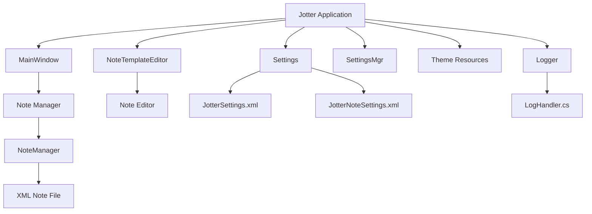

# CodeIntelligenceMap.md

# Jotter Code Intelligence Map

This document is a contributor and AI navigation map that explains which files talk to which other files and why.


##  System Overview

Jotter is a single-project WPF desktop application with code-behind, XML persistence, rich text note editing, theme resources, settings persistence, tray integration, and single-instance enforcement.

High-level architecture:

```text
+--------------------------------------------------------------+
|                        Jotter Application                     |
+--------------------------------------------------------------+
|                                                              |
|   +-------------------+         +-------------------------+  |
|   |    MainWindow     |<--->|   NoteTemplateEditor    |  |
|   |   Note Manager    |         |     Note Editor         |  |
|   +---------+---------+         +------------+------------+  |
|             |                                |               |
|             |                                |               |
|             +---------------+----------------+               |
|                             |                                |
|                    +--------v--------+                       |
|                    |   NoteManager   |                       |
|                    | note model/load |                       |
|                    | save/update     |                       |
|                    +--------+--------+                       |
|                             |                                |
|                   +---------v----------+                     |
|                   |    XML Note File   |                     |
|                   | userdata.xml       |                     |
|                   +--------------------+                     |
|                                                              |
|   +-------------------+         +-------------------------+  |
|   |     Settings      |<------->|      SettingsMgr        |  |
|   |   Settings UI     |         | app + note config XML   |  |
|   +---------+---------+         +------------+------------+  |
|             |                                |               |
|             |                                |               |
|             |                  +-------------v-------------+ |
|             |                  | JotterSettings.xml        | |
|             |                  | JotterNoteSettings.xml    | |
|             |                  +---------------------------+ |
|             |                                                |
|   +---------v---------+                                      |
|   | Theme Resources   |                                      |
|   | Utils/Themes      |                                      |
|   +-------------------+                                      |
|                                                              |
|   +-------------------+                                      |
|   | Logger            |                                      |
|   | LogHandler.cs     |                                      |
|   +-------------------+                                      |
|                                                              |
+--------------------------------------------------------------+
```




---

## 1. Central Relationship Map

```text
App.xaml.cs
  -> controls single-instance startup behavior
  -> launches application runtime normally if no existing instance is active

MainWindow.xaml.cs
  -> uses NoteManager
  -> uses SettingsMgr
  -> uses Logger
  -> opens NoteTemplateEditor windows
  -> transitions to Settings window
  -> applies themes
  -> manages tray behavior
  -> handles search and drag and drop import

NoteTemplateEditor.xaml.cs
  -> edits a Note instance
  -> raises NoteEventArgs updates
  -> depends on save and update flow tied to NoteManager and MainWindow
  -> uses rich text editing behavior

Settings.xaml.cs
  -> uses shared SettingsMgr instance
  -> updates AppSettings
  -> applies themes
  -> affects autosave, tray, and log settings

NoteManager.cs
  -> defines Note
  -> manages ObservableCollection<Note>
  -> loads and saves note XML
  -> creates backups
  -> supports note lookups and updates

SettingsMgr.cs
  -> defines AppSettings
  -> defines NoteSettings and NotesConfiguration
  -> loads and saves settings XML files

Utils/Logging/LogHandler.cs
  -> provides Logger used by main app code

Utils/Themes/*.xaml
  -> theme resources loaded by MainWindow and Settings logic
```

---

## 2. File-by-File Intelligence Notes

### App.xaml.cs

Primary role:

```text
startup and process exclusivity
```

Important behaviors:

- creates per-user mutex
- finds existing process instance
- brings old instance window to foreground
- shuts down duplicate launch

Touch carefully when changing startup experience.

---

### MainWindow.xaml.cs

Primary role:

```text
application orchestration hub
```

Important known responsibilities from method inventory:

```text
SwitchTheme
LoadAppSettings
SaveAppSettings
LoadAppNoteSettings
OpenSelectedNote
DeleteSelectedNote
PerformSearch
ClearSearch
SortNotesList
InitializeDragDrop
MainWindow_Drop
ConvertHTMLToText
AddNewNoteWithText
TransitionToSettings
InitializeTrayIcon
ShowApplication_Click
ExitApplication_Click
MainWindow_StateChanged
NotifyIcon_MouseDoubleClick
```

Interpretation:

- this file is both shell UI logic and app coordinator
- changes here often ripple into settings, notes, editor windows, search, or tray behavior
- ideal edits are narrow and deliberate

---

### NoteManager.cs

Primary role:

```text
note data and XML persistence
```

Important known members:

```text
LoadNotes
JustExit
GetIndexOfSelectedNoteById
AddUpdateNote
RemoveNote
SaveNotes
GenerateID
UpdateNoteByIdIndexer
CreateBackup
SearchContext
```

Interpretation:

- if a bug touches note persistence, start here
- if old note files stop loading, start here
- if note IDs or updates go strange, start here

---

### NoteTemplateEditor.xaml.cs

Primary role:

```text
single-note editing experience
```

Important known members:

```text
LoadNoteContent
UpdateSelectedNoteContent
SaveNoteChanges
RchEditNote_TextChanged
SaveTimer_Tick
UpdateSelectedNoteTitle
SpotlightSearch
FindTextInRange
ResetSpotlights
```

Interpretation:

- title and content editing lives here
- autosave timing lives here
- in-note search highlighting lives here
- rich text behavior lives here

If formatting breaks, this file is near the blast radius.

---

### SettingsMgr.cs

Primary role:

```text
settings persistence for app and note windows
```

Important known members:

```text
LoadSettings
SaveSettings
LoadNoteSettings
SaveNoteSettings
GetNoteConf
SaveNoteConf
RemoveNoteConf
```

Interpretation:

- app-level behavior and per-note window persistence meet here
- if note windows stop remembering size or position, start here
- if settings reset unexpectedly, start here

---

### Settings.xaml.cs

Primary role:

```text
settings window UI behavior
```

Important known members:

```text
SwitchTheme
LoadAppSettings
cb_ThemeSelectionChanged
cb_AutoSaveValChanged
CheckedMinimizeToTray
CheckedFullExit
CloseSettings_Click
```

Interpretation:

- user-facing settings interactions live here
- theme choice, autosave interval, tray behavior, and log settings all pass through here

---

### Utils/Logging/LogHandler.cs

Primary role:

```text
custom logging infrastructure
```

Important known members:

```text
LogInfo
LogError
WriteLog
```

Interpretation:

- new logging should route through this logger
- do not casually fork logging style into separate ad hoc file writes

---

## 3. Dependency-Oriented Task Routing

If the task is about X, look at Y first.

### Notes do not load or save

Start with:

```text
NoteManager.cs
MainWindow.xaml.cs
```

### Editor content is wrong or not saving

Start with:

```text
NoteTemplateEditor.xaml.cs
NoteManager.cs
```

### Settings are not sticking

Start with:

```text
SettingsMgr.cs
Settings.xaml.cs
MainWindow.xaml.cs
```

### Theme switch is broken

Start with:

```text
Settings.xaml.cs
MainWindow.xaml.cs
Utils/Themes/
```

### Tray behavior is broken

Start with:

```text
MainWindow.xaml.cs
Jotter.csproj
```

### Logging path or messages are wrong

Start with:

```text
Utils/Logging/LogHandler.cs
Settings.xaml.cs
MainWindow.xaml.cs
```

### Drag and drop import is broken

Start with:

```text
MainWindow.xaml.cs
```

---

## 4. Change Impact Hints

### Low-Risk Changes

Usually low risk:

- documentation
- readme updates
- small XAML visual tweaks that do not affect behavior
- adding targeted logs
- refining search UX text

### Medium-Risk Changes

Usually medium risk:

- theme switching edits
- settings UI behavior changes
- drag and drop import improvements
- tray menu behavior changes

### High-Risk Changes

Usually high risk:

- note serialization changes
- rich text storage changes
- note identity handling
- startup and single-instance logic
- autosave timing behavior
- deletion flow changes

---

## 5. Suggested Future Refactor Boundaries

If Jotter ever gets a deeper structural cleanup, these seams are the natural candidates:

```text
UI concerns from MainWindow.xaml.cs
note persistence from NoteManager.cs
settings persistence from SettingsMgr.cs
logging remains isolated in Utils/Logging/
```

But for now, the practical rule is:

```text
understand the current owner file first
edit locally
avoid repo-wide surgery
```

---

## 6. Mental Model Summary

Think of the application like this:

```text
App.xaml.cs
  guards the front door

MainWindow.xaml.cs
  runs the building

NoteManager.cs
  guards the filing cabinet

NoteTemplateEditor.xaml.cs
  is the writing desk

SettingsMgr.cs
  remembers how the room was arranged

LogHandler.cs
  keeps the diary
```


